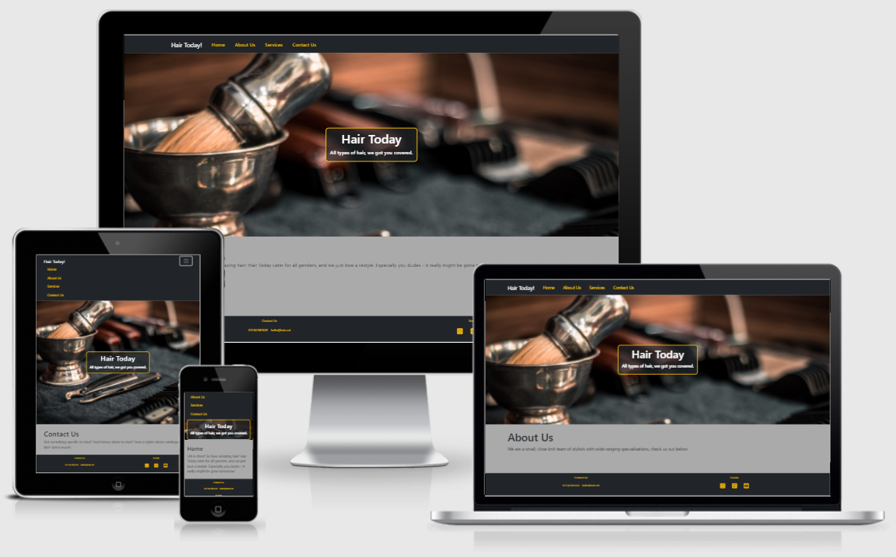

# **Hair Today!**

# Overview
A mock hairdresser/barber website aimed at learning to use SQL with PHP.  First stages are to use the database and PHP to create dynamic content, and learn about linked tables.

# Index
1. [UX](#ux)
1. [Features](#features)
    * [Existing Features](#existing-features)
    * [Features for Future Implementation](#features-for-future-implementation)
1. [Technologies Used](#technologies-used)
1. [Credits](#credits)
    * [Website](#website-credits)
    * [README](#readme-credits)

## UX

### **Overview and Broad Design Choices**
Our imaginary hairdresser is unisex, and provides niche services such as curly cuts and beard so neutral greys were chosen along with a bright yellow to give a punchy, modern look (mostly from Bootstrap base palette to keep design simple as the focus is on learning to use PHP and SQL).

## Features

### **Existing Features**
Features common to all pages/sections:
* Single page design which populates with dynamic content from the database.
* Responsive design for all device sizes.
* Large image to elicit positive emotional response.
* Mirrored header and footer for intuitive use.

### **Features for Future Implementation**
1. Further dynamic content | To increase user familiarity with staff and services and therefore encourage bookings.
1. Activate email contact | To allow prospective customers to get in touch
1. Online booking system | To allow customers to select the service they want, the stylist and an available time slot.

## Technologies Used

### **Languages**
* HTML5 is used to provide the basic structure of the website.
  * About: [HTML5 Wiki](https://en.wikipedia.org/wiki/HTML5)
  * Creator: [W3 Consortium](https://www.w3.org/)
* CSS3 is used to provide most of the styling for the website.
  * About: [CSS3 Wiki](https://en.wikipedia.org/wiki/CSS)
  * Creator: [W3 Consortium](https://www.w3.org/)
* JavaScript is used to provide some of the interactive nature of such components throughout the website, via Bootstrap.
  * About: [JavaScript Home](https://www.javascript.com/)
* PHP is used to facilitate the dynamic content of the website, and communicate with the SQL server.
  * About: [PHP Home](https://www.php.net/)

### **Libraries and Frameworks**
* [Bootstrap 5](https://getbootstrap.com/) is used to provide the grid functionality for uniform design, responsiveness and to enable the use of modal and hamburger menu.
* [Font Awesome](https://fontawesome.com/) is used to provide the icons for the website.

### **Tools**
* [Git](https://git-scm.com/)/[GitHub](https://github.com/) was used for version control and repository storage.
* [Visual Studio Code](https://code.visualstudio.com/) was the IDE used to write the project.
* [Chrome Dev Tools](https://developers.google.com/web/tools/chrome-devtools) were used for specific responsiveness testing and drilling down into bug fixing.
* [Lighthouse](https://developers.google.com/web/tools/lighthouse) was used for macro testing and identification of errors for rectification.

### **Other Resources**
* [XAMPP](https://www.apachefriends.org/index.html) was used to compile PHP code.

* [HeidiSQL](https://www.heidisql.com/) was used to create and manage the SQL database.

## Credits

### **Website Credits**

#### Content
The content of the website is entirely fictional.  All references to people or places have no basis in real life, and any similarities to real persons or places is purely coincidental.

#### Media
* The photographs used for the website were obtained from [Pexels.com](https://www.pexels.com/):
* [Hero](https://www.pexels.com/photo/gray-hand-tool-1319459/)

#### Acknowledgements
Thank you in particular to:
* Shaun Dobie for tutoring the technologies underlying the project.

### **README Credits**

#### Content
Structure and content based heavily on:
* [Code Institute Solutions - README Template](https://github.com/Code-Institute-Solutions/readme-template)

#### Media
The images for this README are from the following sources:
* Snips taken from GitHub.
* [Am I Responsive](http://ami.responsivedesign.is/).

#### Other
* Markdown basic taken from [Mastering Markdown](https://guides.github.com/features/mastering-markdown/).

**This website was produced as an educational project.**

**Created by Amy Hacker.**

[Back to Top](#hair-today)

